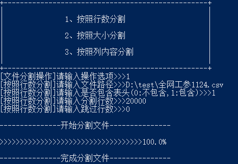
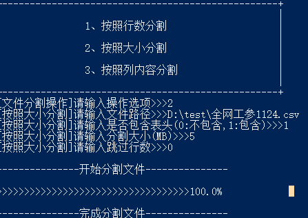
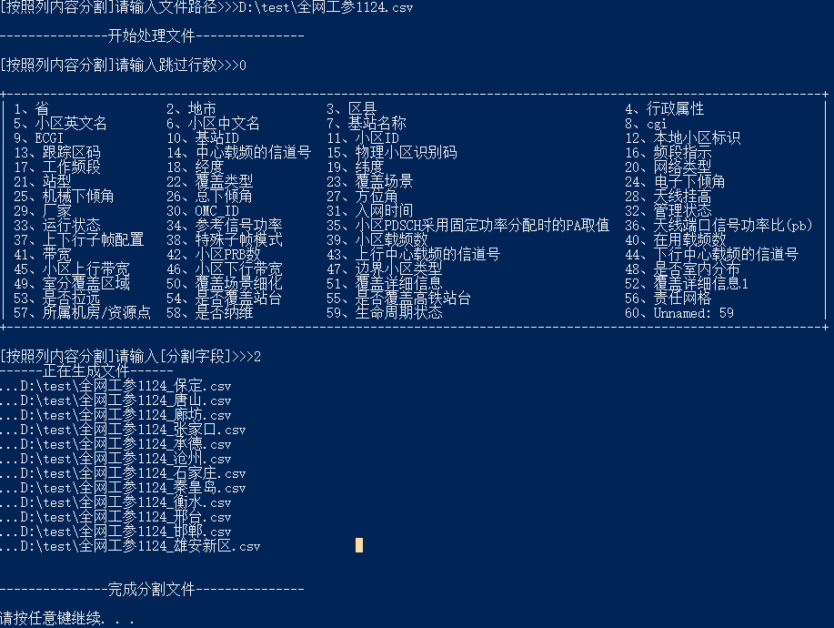
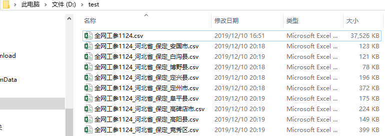

***FileOperator***  
_author：linle_  
_createtime:2019/12_  
程序主要功能是对文件的分割和合并操作，在日常数据处理中可以将多个csv、txt、xlsx、xls文件合并成一个文件，或将大文件拆分成多个小文件，以帮助我们进行更快速的数据的统计分析。  
*程序结构树：*  
   
*1、程序的入口：*    
/bin/run.py 通过python run.py打开程序  
###2、程序的操作示例：  
1、进入程序 python run.py  
  
2、按照提示输入操作选项  
  
3、按照提示输入相关参数，等待处理结束  
  
###3、功能介绍  
####*1、文件合并*  
文件合并包括简单文件合并和复杂文件合并，用户根据文件内容进行选择，简单文件合并是简单粗暴的对文件进行合并，效率更高  
复杂文件合并是针对文件有不同表头，按照表头内进行合并，合并速度较慢。  
  
#####1> 简单文件合并  
如果用户的文件结构相同，可以直接简单粗暴的进行文件合并则可选择该功能，主要输入参数  
    
_目录路径：文件的存放路径，将文件放到单独的文件夹内，填入文件夹的路径_  
  
_是否包含表头:0不包含表头1包含表头_  
_跳过行数:如果文件的前面几行非有效内容，需要跳过，则输入该参数，如果不需要跳过则输入0_  
下面文件结构需跳过7行  
  
_输出结果:分割结果保存在用户输入的文件夹内，名称以Result_UnionTable+时间戳.csv命名_  
#####2> 复杂文件合并  
当文件的表头可能不相同时需要先对表头进行判断，按照表头将表汇总，合并速度较慢，但在不能保证所有文件表头都相同的情况下需要使用该方法  
复杂表结构合并示例：  
   
参数与简单文件合并一致  
####*2、文件分割*  
文件分割包括按照行数分割，按照大小分割，按照列内容分割三类  
   
#####1> 按照行数分割  
根据用户输入的行数分割文件，主要输入参数  
  
_需要注意的是输入的路径是文件的路径而不是文件夹的路径_  
#####2> 按照大小分割  
根据用户输入的行数分割文件，主要输入参数  
     
#####3> 按照列内容分割  
根据用户输入的列分割文件，输入参数与以上两种分割方式不同，先输入跳过行数，程序跳过行后会读取表头并打印出来，用户可以根据表头内容选择分割的列   
输入的分割的列支持正则表达式输入：  
_按照第2列读取输入：2_  
_按照第2,3列读取：2,3或2-3_  
_自动去除重复字段：1,1-3 #自动去除重复输入的字段，最终结果是1,2,3_  
  
_输出结果：文件名称以原文件名+分割字段名.csv命名  
  
###*tips1：关于excel多sheet文件的处理*  
excel多sheet的文件的合并和分割的处理流程是相同的：  
_excel->按照sheet另存为多个csv文件，空sheet不保存->针对每个sheet进行合并和分割。_  
###*tips2：多进程加速处理效率*  
_程序最耗时的处理过程是将较大的excel按照sheet另存为csv，本程序实现按照电脑cpu数量拆分成多进程进行处理，提升处理效率。_  
###*tips3：大数据处理的支持*  
_如果将一个10G的文件按照每1G大小分割成10个文件，如果程序一次性读取1G文件进行分割，受限于内存大小限制会有内存溢出风险，且处理效率极低。_  
_本程序一次性只读取50MB大小，通过读取写入的循环操作完成文件的分割，避免了内存溢出风险，对大数据实现完美支持，另按行合并和分割时一次最多读取50万行数据_  
###*tip4：在线更新检查功能*
_在模块3中实现了在线检查更新功能，本功能是通过连接github实现，由于外网网速不稳定，可能会有连接超时现象，需重复试几次。_  
  
###*tip5：退出和返回上一层操作*
_在程序所有环节均可以输入q（不区分大小写）退出程序，输入b返回上一层（不区分大小写）。_  

